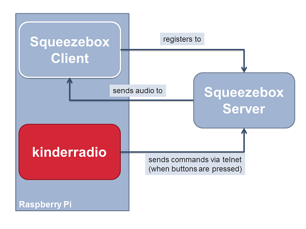

kinderradio
===========

kinderradio is a streaming player built into a lunchbox with a simple button and LED interface suitable for small
children. It is a small project that I did in my spare time. 

I'm releasing the code for everyone interested in such projects. It is up to you if it is worth to exactly rebuild this 
particular device. However, several aspects of this project might help you with your own idea, especially if you are 
interested in

* how to program in Java on a Raspberry Pi (using Maven as a build tool, also for transferring your build to the pi),
* how to deal with button press events using [Pi4j](http://pi4j.com/),
* how to control a squeeze box player remotely,
* how to burn your fingers when soldering small cables to fiddly little buttons,
* ...

Functionality
-------------

The device requires external speakers. When started, the green LED is lit indicating that
the player is ready. A press of one of the first four buttons starts playing either music from a HTTP stream or an album
from a local [Logitech Media Server](https://en.wikipedia.org/wiki/Logitech_Media_Server). When playing an album, another
press of the same button advances to the next title. Every button push briefly turns the device into a "busy" state as
indicated by the yellow LED. The red button stops the player (this time the busy state is indicated by the red LED).
Press the red button for five seconds to shutdown the raspberry pi. This is recommended rather than just unplugging
the power, which can cause SD card corruption.

**A note on the media server**: The main reason why I chose to use a media server was that is was already existing
in my home network. You can easily modify the program to directly play local mp3 files or HTTPS streams e. g. by making 
system calls to command line player like [mpg123](https://www.mpg123.de/) or use an mp3 player Java lib.

Hardware
--------

Inside the lunchbox, there is a Raspberry Pi 2 Model B (I also tested it with a Pi 1 Model B+) with a wifi dongle
connected. I drilled some holes into the lunchbox to connect it to audio (active speakers) and to power (microUSB). 
The buttons and LEDs are connected similar to the following scheme (using 10kΩ resistors):

For the kinderradio, I use five buttons and three LEDs. In order to determine the correct I/O pins, see 
`de.neshanjo.kinderradio.gpio.Wiring` and the pin numbering scheme from [Pi4j](http://pi4j.com/) suitable for your device.

Software
--------

In order to use the player, you need to have a 
[Logitech Media Server](https://en.wikipedia.org/wiki/Logitech_Media_Server) installed. In my setup, I use another
raspberry pi to run this server. However, principally, you can install it on the same device. There are guides
how to install the server on a raspberry pi.

On your pi, a recent version of [raspbian](https://www.raspberrypi.org/downloads/raspbian/) should be installed. Raspbian
Jessie already comes with a JDK.

Furthermore, you need to install a squeeze player on the pi. There are a lot of useful
resources on the web, e. g. [this tutorial](http://www.gerrelt.nl/RaspberryPi/wordpress/tutorial-installing-squeezelite-player-on-raspbian/)
how to install such a player. I recommend to setup it as a service (automatic start).

**Note**: It might be worth to have a look at [Max2Play](https://www.max2play.com/) which offers an easy to install
and configure system with both Logitech Media Server and squeeze player modules. I haven't tried it yet and haven't 
found information if java is installed on their images.

The general system architecture is as follows:

Hence, summarising, the kinderradio java program is a controller of the squeeze player that
sends commands when buttons are pressed. 

Internally, I divided the code into several componentes, as shown below:

Build, Install and Run
----------------------

You can easily build the project via [Apache Maven](https://maven.apache.org/). Checkout the project and run `mvn install`.
There is a special build profile `copy_to_pi` which you can use to build the project and copy it to your raspberry pi.
Therefore, you have to edit your `${user.home}/.m2/settings.xml` (create it if it does not exist) and 
[add some properties](https://maven.apache.org/examples/injecting-properties-via-settings.html): `pi.user`, `pi.passwd`, 
`pi.server`, `pi.kinderradio.dir`. When running `mvn install -Pcopy_to_pi`, the generated jar file and all dependencies 
are copied to `pi.kinderradio.dir` on your pi.

To run the program, log on to your pi and run `sudo <pi.kinderradio.dir>/kinderradio.sh` (replace `pi.kinderradio.dir`
with the correct directory). If you like to have the program run on start up, open `/etc/rc.local` and add the line 
`sh <pi.kinderradio.dir>/kinderradio.sh&` before the line `exit 0`.

Configuration
-------------

There is a file kinderradio.sample.properties. Copy it to kinderradio.properties and adapt the settings. If a button
is assigned to a URL (starting with `http`), it is played as a stream. Otherwise, an album starting with the given
string is played (if found).

Improvements and Known Issues
-----------------------------

As mentioned before, this is only a hobby project. Since it works for me as it is now and I only have limited time, 
I do not expect much more development. Anyway, here is a list of points that could be improved:

1. An album is not found if its name contains German umlauts. This is very likely an encoding or charset problem.
1. It would be nice if the pi would run an operating system that boots into memory and does not need SD card access.
   Then the player can be powered off without the need of a regular shutdown.
1. There are some places in the code that could need a closer look, like duplicate code in the package
   `de.neshanjo.kinderradio.callback`, addressing the buttons via ints (zero-based vs. the one-based configuration
   getters), and certainly many more.

Questions?
----------

Feel free to send me a mail (`java@neshanjo.de`) or create an issue in github.

License
-------
The license is [GPL v3](http://www.gnu.org/licenses/gpl.html), see `LICENSE` for details.